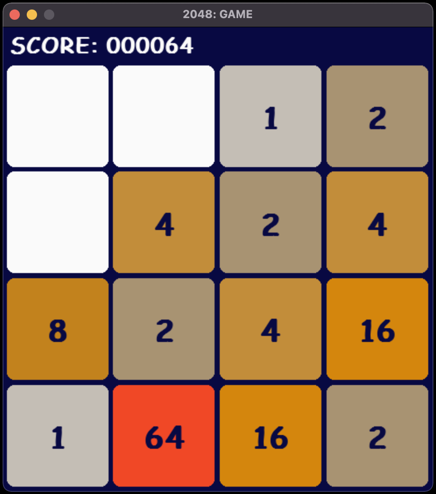

# 2048-Project

### Python implementations of the popular 2048 game using the Pygame library (for creating GUI). The directory contains two slightly different applications of the game.

##

<p align="center">
  <i>Preview of the board of the 2048 game:</i>
</p>


<p align="center">
  
</p>

##

1. Implementation 1 <i>~ aimed to be played by a human user</i>
  
- The user might select a grid 3x3, 4x4, 5x5, or 6x6. 
- The grid is initialized with 2 random numbers (either 1 (highest probability rate), 2 or 4).
- The original game 2048, starts from 2, whereas this example starts from the value of 2<sup>0</sup> instead of 2<sup>1</sup> in order to make it more diffcult - and more CS-friendly!
- The game itself is controlled by the user using arrow keys.
- The aim is to obtain the highest possible power of 2 in the board, i.e. the game goes further than 2048.
- The user's scores for each grid are stored in an SQLITE database, and are processed using pandas.
- Additionally, the implementation contains a Jupyter Notebook for simple analysis of the data collected in the database.

#### Running the Implemenation 1: navigate to the right directory (from the project root directory); then, run the main Python file.

```
cd User-Implementation/
```

```
python main.py
```

##

2. Implementation 2 <i>~ aimed to be solved by an AI bot</i>

- The game automatically initializes with a 4x4 grid and so there is no grid selection.
- The grid is initialized with 2 random numbers (either 1 (highest probability rate), 2 or 4).
- The game is controlled by the AI bot (appropriate searching algorithms).
- The aim for the bot is to obtain at least one 2048 square in the board.
- The game is terminated when the bot reaches the score of 2048, which denotes a goal state to obtain.

#### Running the Implemenation 2: navigate to the right directory (from the project root directory); then, run the main Python file.

```
cd AI-Implementation/
```

```
python main.py
```
