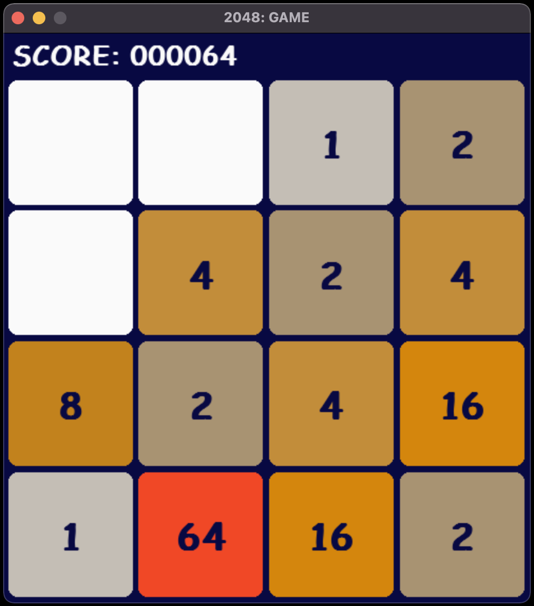

# ```2048-intelligent-bot``` 🤖

> **Note**
I implemented the first version of AI during my first year of studies in early 2022. Back then, the project's win rate was hovering just above 30.0%. Fast forward to August 2023, and I found myself revisiting the project. After some code refactoring and algorithm improvements, the revamped version now boasts a decent win rate of over 70% thanks to the algorithm improvements!

## The repo contains my own implementation of [2048](https://en.wikipedia.org/wiki/2048_(video_game)), which used to be recognized as a very popular mobile game back in the day. The game was developed in Python using a number of popular libraries, e.g. [pygame](https://www.pygame.org/news), [pandas](https://pandas.pydata.org/), [numpy](https://numpy.org/), etc. The aim of the project was to develop an intelligent bot to solve the game domain problem. Please follow the descriptions below to find out more about the code!

#

<p align="center">
  <b style="font-size: 2rem;">Preview of the Game Board</b>
</p>


<p align="center">
  
</p>

#

## About the Implementation

The bot attempts to solve the game and reach the goal state by following the logic of [Monte Carlo Tree Search](https://en.wikipedia.org/wiki/Monte_Carlo_tree_search). Essentially, it means that the algorithm expands the decision tree by simulating the future states of the current state of the 4x4 grid in order to calculate ```costs``` for each of the four moves: ```['up', 'down', 'right', 'left']```. The ```search depth``` and ```searches per move``` variables are dynamically adjusted based on the number of performed moves. The ```costs``` are calculated by combining the highest score obtained in each simulated grid and the number of empty spots mutiplied by specified constants. Each selected best move is denoted by the highest ```costs``` value. Including the number of empty spots multiplied by the constant might seem unconventional at first, but it definitely affects the speed of the search (especially at the beginning) and also slightly increases the accurracy of the algorithm.

#

## Rules Recap

The implementation uses the following rules:
- The goal of the bot is to obtain at least one square with the value of ```2048``` in the 4x4 grid.
- The game automatically initializes with a specified 4x4 grid size.
- The only value inserted into the grid is 2 (100% probability).
- The game is controlled by the AI bot which selects most optimal moves using - [Monte Carlo Tree Search](https://en.wikipedia.org/wiki/Monte_Carlo_tree_search) algorithm.
- The game is terminated when the bot reaches the score of ```2048```, which denotes a goal state (or when it loses the game).

#

## Bot Performance

The new 2023 version of AI was tested for slightly more than 300 samples and the results were stored in an ```SQLITE3``` database. 

Performance highlights based on the [data](https://github.com/chizo4/2048-Project/blob/main/code/notebook/bot_notebook.ipynb) collected while testing:
- ```Probability of AI winning a game : 70.1%```
- ```Probability of a score greater or equal to 1024 : 93.7%```
- ```Average time to win a game : 100.16 sec```

```
❗❗❗ NB: The average time records can be rather described as biased, since it is mainly dependant on the performance of your machine. The reference point for time measurements in this experiment was 2020 M1 MacBook Pro.
```

The whole analysis of the results in a Jupyter Notebook can be accessed [here](https://github.com/chizo4/2048-Project/blob/main/code/notebook/bot_notebook.ipynb).

#

## Running AI

- Before cloning the latest version of the project and start playing with the code, please make sure that you have ```python3``` and ```pip``` installed on your machine by running the following commands:

```shell
python3 -V
```

```shell
pip -V
```

```
❗❗❗ If your shell failed to recognize these commands, please visit [pip](https://pip.pypa.io/en/stable/installation/) and [python](https://www.python.org/downloads/) to find out more about the installation process.
```

- Otherwise, if you manage to see the versions of ```python3``` and ```pip``` after running the commands, you can clone the whole repo:

```shell
git clone https://github.com/chizo4/2048-intelligent-bot
```

- After cloning it, please navigate into the root directory of the project and run the ```bash``` script to install any needed libraries. Do not worry if you have some of them pre-installed, the script will only install the ones that are missing. Please run the commands:

```shell
cd 2048-intelligent-bot
```

```shell
bash setup.sh
```

- The next step to follow is to navigate into the ```code``` directory:

```shell
cd code
```

- Finally, you are able to run the AI bot invoking (make sure to stay in the ```code``` directory):

```shell
python main.py
```

#

## Contribution & Collaboration

In case you had an idea on how to improve the performance of the AI bot by either increasing its win percentage or decreasing the time needed to win a game, feel free to contact me via any of the links included in my [GitHub bio page](https://github.com/chizo4). You might also contribute to the project by opening a pull request with suggested improvements.

#
